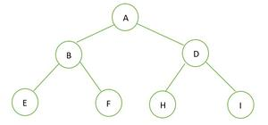
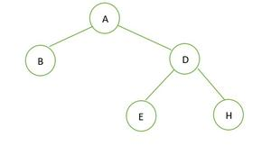
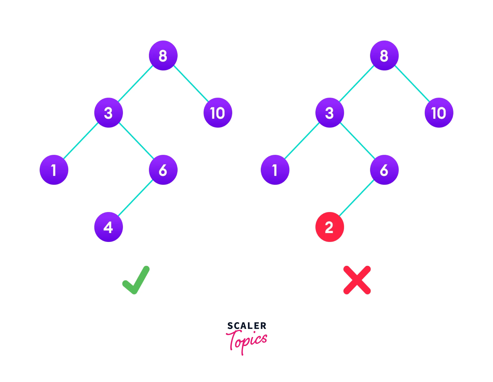

A tree data structure is a hierarchical structure that is used to represent and organize data in a way that is easy to navigate and search. It is a collection of nodes that are connected by edges and has a hierarchical relationship between the nodes. 

The topmost node of the tree is called the root, and the nodes below it are called the child nodes. Each node can have multiple child nodes, and these child nodes can also have their own child nodes, forming a recursive structure.

Basic Terminologies In Tree Data Structure:
Parent Node: The node which is a predecessor of a node is called the parent node of that node. {B} is the parent node of {D, E}.
Child Node: The node which is the immediate successor of a node is called the child node of that node. Examples: {D, E} are the child nodes of {B}.
Root Node: The topmost node of a tree or the node which does not have any parent node is called the root node. {A} is the root node of the tree. A non-empty tree must contain exactly one root node and exactly one path from the root to all other nodes of the tree.
Leaf Node or External Node: The nodes which do not have any child nodes are called leaf nodes. {K, L, M, N, O, P, G} are the leaf nodes of the tree.
Ancestor of a Node: Any predecessor nodes on the path of the root to that node are called Ancestors of that node. {A,B} are the ancestor nodes of the node {E}
Descendant: Any successor node on the path from the leaf node to that node. {E,I} are the descendants of the node {B}.
Sibling: Children of the same parent node are called siblings. {D,E} are called siblings.
Level of a node: The count of edges on the path from the root node to that node. The root node has level 0.
Internal node: A node with at least one child is called Internal Node.
Neighbour of a Node: Parent or child nodes of that node are called neighbors of that node.
Subtree: Any node of the tree along with its descendant.

## Binary Tree -: 
Binary Tree is defined as a tree data structure where each node has at most 2 children. Since each element in a binary tree can have only 2 children, we typically name them the left and right child.

Binary Tree Representation

A Binary tree is represented by a pointer to the topmost node (commonly known as the “root”) of the tree. If the tree is empty, then the value of the root is NULL. Each node of a Binary Tree contains the following parts:

                                        Data
                                    /           \               
                              Pointer to       Pointer to 
                              left child       right child

## Complete Binary Trees -:

A complete binary tree is a binary tree that satisfies two properties. First, in a complete binary
tree, every level, except possibly the last, is completely filled. Second, all nodes appear as far
left as possible.

The formula can be given as—if K is a parent
node, then its left child can be calculated as 2 × K and its right
child can be calculated as 2 × K + 1. For example, the children
of the node 4 are 8 (2 × 4) and 9 (2 × 4 + 1). Similarly, the
parent of the node K can be calculated as | K/2 |. Given the
node 4, its parent can be calculated as | 4/2 | = 2. 
The height  of a tree Tn having exactly n nodes is given as: 
#### Hn = | log2(n + 1) |

## Extended Binary Trees

A binary tree T is said to be an extended binary tree (or a
2-tree) if each node in the tree has either no child or exactly
two children. Figure 9.8 shows how an ordinary binary tree is
converted into an extended binary tree.
In an extended binary tree, nodes having two children are called
internal nodes and nodes having no children are called external
nodes. In Fig. 9.8, the internal nodes are represented using circles
and the external nodes are represented using squares.
To convert a binary tree into an extended tree, every empty sub-tree is replaced by a new
node. The original nodes in the tree are the internal nodes, and the new nodes added are called
the external nodes.

## Perfect Binary Tree vs Complete Binary Tree:
A binary tree of height ‘h’ having the maximum number of nodes is a perfect binary tree. 
For a given height h, the maximum number of nodes is 2h+1-1.

A complete binary tree of height h is a perfect binary tree up to height h-1, and in the last level element are stored in left to right order.

Example 1: 

The height of the given binary tree is 2 and the maximum number of nodes in that tree is n= 2h+1-1 =  22+1-1 =  23-1 = 7.
Hence we can conclude it is a perfect binary tree.
Now for a complete binary tree, It is full up to height h-1 i.e.; 1, and the last level elements are stored in left to right order. Hence it is a complete Binary tree also.

## Full Binary Tree vs Complete Binary tree:
For a full binary tree, every node has either 2 children or 0 children.

Example 1:

In the given binary tree there is no node having degree 1, either 2 or 0 children for every node, hence it is a full binary tree.

For a complete binary tree, elements are stored in level by level and not from the leftmost side in the last level. Hence this is not a complete binary tree.

#### The binary tree can be represented using an array of size 2n+1 if the depth of the binary tree is n. If the parent element is at the index p, Then the left child will be stored in the index (2p)+1, and the right child will be stored in the index (2p)+2.

###  Binary Search Tree in C
A binary search tree is a tree data structure that allows the user to store elements in a sorted manner. It is called a binary tree because each node can have a maximum of two children and is called a search tree because we can search for a number in O(log(n)) time.

The properties of a regular binary tree are:

All nodes in the left subtree have a value less than the root node
All nodes in the right subtree have a value more than the root node
Both subtrees of each node are also binary search trees, i.e. they have the above two properties

### AVL TREES
AVL tree is a self-balancing binary search tree invented by G.M. Adelson-Velsky and E.M. Landis
in 1962. The tree is named AVL in honour of its inventors. In an AVL tree, the heights of the two
sub-trees of a node may differ by at most one. Due to this property, the AVL tree is also known
as a height-balanced tree. The key advantage of using an AVL tree is that it takes O(log n) time to
perform search, insert, and delete operation

Balance factor = Height (left sub-tree) – Height (right sub-tree)